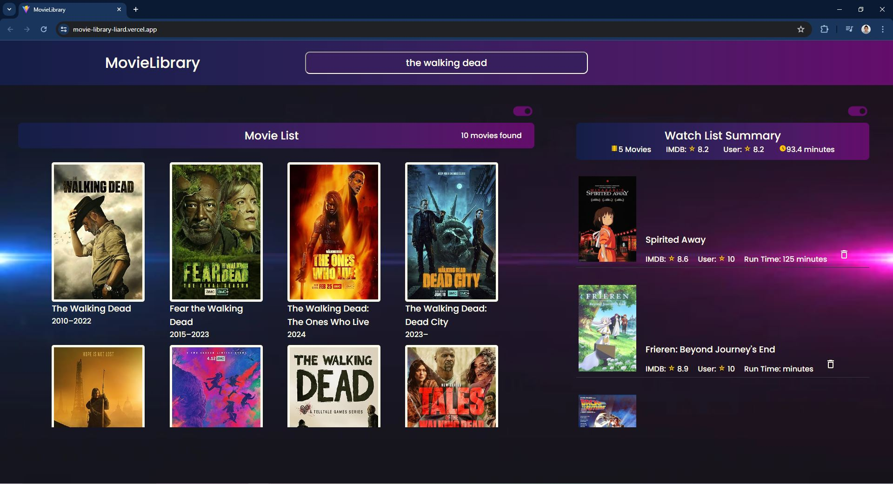

This is a simple website where you can search for movies and add them to your list of movies. The website is built using ReactJS + Vite, utilizing the useState, useEffect, useRef, and custom Hook for data fetching from an API and local storage.
